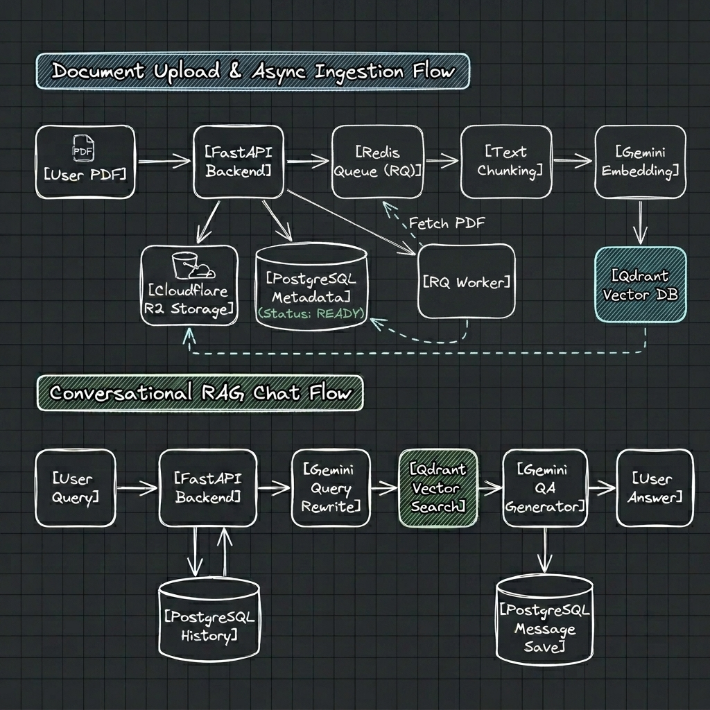

# PDF.chat - Full-Stack Conversational RAG Platform

`PDF.chat` is a modern, production-oriented Retrieval-Augmented Generation (RAG) platform. It allows users to authenticate via Google OAuth, upload PDF documents, and have interactive, context-aware conversations grounded in their document's content.

---

## 1. Project Architecture & Structure

The repository is structured as a monorepo containing two main application components:

- **Backend (FastAPI)**: Implements database integrations (PostgreSQL, Qdrant), Cloudflare R2 object storage, asynchronous task queuing via Redis & RQ Worker, PDF document chunking and embedding generation, auth session verification, query-rewriting, and conversational QA pipelines. 
  - Details: [backend/architecture.md](file:///c:/Users/ayush/Desktop/usecase/projects/chatwpdf/backend/architecture.md)
- **Frontend (Next.js 15)**: Provides the user interface utilizing React, Tailwind CSS (v4), Zustand for state management, Radix UI primitives, TanStack Query for server state caching, and Better Auth client-side SDK.
  - Details: [frontend/architecture.md](file:///c:/Users/ayush/Desktop/usecase/projects/chatwpdf/frontend/architecture.md)

## 2. Core Application Flows

### A. Authentication Flow
1. **Google OAuth Initiation**: The user navigates to the login page and clicks **Sign in with Google**.
2. **Session Persistence**: Next.js delegates authentication to **Better Auth** API routes, which coordinate with Google OAuth. Upon successful verification, user metadata and session details are persisted to the PostgreSQL database.
3. **Session Guards**: Client-side page navigation is protected using a custom Next.js Edge proxy middleware ([src/proxy.ts](file:///c:/Users/ayush/Desktop/usecase/projects/chatwpdf/frontend/src/proxy.ts)) and client auth guards ([src/features/auth/auth-guard.tsx](file:///c:/Users/ayush/Desktop/usecase/projects/chatwpdf/frontend/src/features/auth/auth-guard.tsx)).
4. **Backend Verification**: Every backend request is checked by the FastAPI backend using a dependency. It intercepts the user session cookie, verifies it directly against the Better Auth session validation endpoint, and extracts the authenticated User ID.

### B. Document Upload & Ingestion Flow
1. **PDF Upload & Storage**: When a user uploads a PDF via `POST /documents`, the FastAPI backend streams the file directly to **Cloudflare R2** object storage (`documents/<uuid>.pdf`).
2. **Metadata Ledger**: A database entry is created in PostgreSQL with `status = PENDING`.
3. **Async Task Queuing**: An ingestion task (`process_document`) with `document_id` and `user_id` is enqueued into **Redis Queue (RQ)**. The PDF binary itself is stored safely in Cloudflare R2 and not passed through Redis.
4. **Worker Processing**: An independent **RQ Worker** process (`python -m app.queue.worker`) pops the job from Redis, retrieves metadata from PostgreSQL, and downloads the PDF from Cloudflare R2 into OS temporary file storage.
5. **RAG Indexing**: The worker parses PDF pages (PyPDF), chunks text, computes embeddings via Google Gemini (`text-embedding-004`), and upserts vector payloads into **Qdrant**.
6. **Cleanup & Finalization**: The worker deletes the temporary file and updates the document status in PostgreSQL to `READY`.

---

## 3. Local Setup Guide

Both the backend and frontend components require distinct setups, packages, and environment configurations:

### Backend Setup
For backend system requirements, virtual environment setup, library installations, database migrations (Alembic), Redis configuration, and runtime server/worker commands, please refer specifically to the:
👉 **[Backend Architecture & Setup Guide](file:///c:/Users/ayush/Desktop/usecase/projects/chatwpdf/backend/architecture.md)**

### Frontend Setup
For frontend Node.js environment requirements, npm package installation, Next.js environment configurations (`.env.local`), and local development server commands, please refer specifically to the:
👉 **[Frontend Architecture & Setup Guide](file:///c:/Users/ayush/Desktop/usecase/projects/chatwpdf/frontend/architecture.md)**
